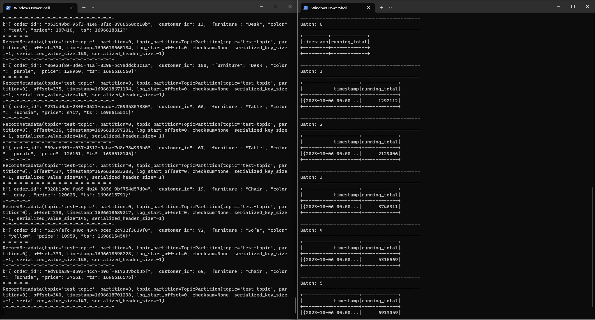

# Batch Processing with PySpark

This project demonstrates a Data Pipelines for Streaming System with:

Event Producer:
- Produce purchasing events with faker

Streaming job:
- Listen to kafka topic
- Aggregate for daily total purchase
- Write it to console with these columns: Timestamp, Running total
- Using foreachBatch


## How to run
1. Clone this repository
2. Open terminal / CMD and change the directory to the cloned repository folder and run `make help` to check what we can run.
    
3. Run:
    ```console
    make docker-build
    ```

    
4. After the setup is complete, run these two commands in order:     
    `make spark`

    
    
    `make kafka`
    
 
5. Open the spark master container with docker desktop in terminal and run `chmod -R 777 /scripts/logs`
    
    
    to prevent mkdir error for the next steps.

6. Run `make produce-events` to create fake events about furniture store data.
    

7. Open the folder in a new terminal and run `make consume-events` to consume the created fake events.

    
 


## Docker Troubleshooting
### mkdir error when running `make consume-events`
This error happens because of permission issue, make sure that you have done the step 5 on the previous section. If the issue persists, then it might be because the "logs" folder is not empty, delete all files in the "logs" folder, and then run `make consume-events` again.
    

### `dataeng-network already exist` when `make docker-build`
The solution is quite simple, run `docker network rm network-name`:
```console
docker network rm dataeng-network
```
You can also check the lists of network already created by running:
```console
docker network ls
```
Another useful command: `docker network prune` to delete all networks created in docker environment.
After deleting the network, you can start again from `make docker-build`.
